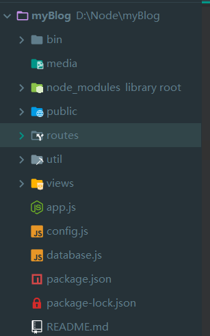
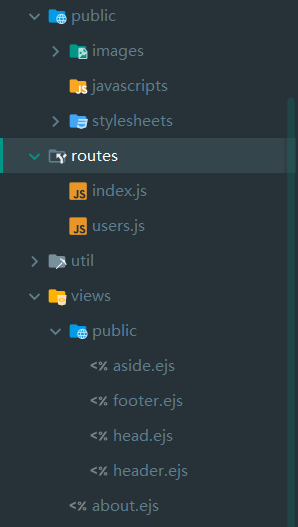
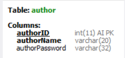
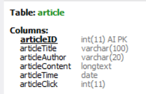
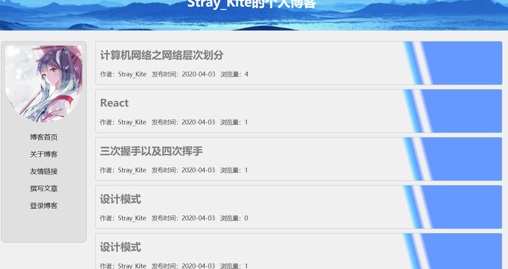
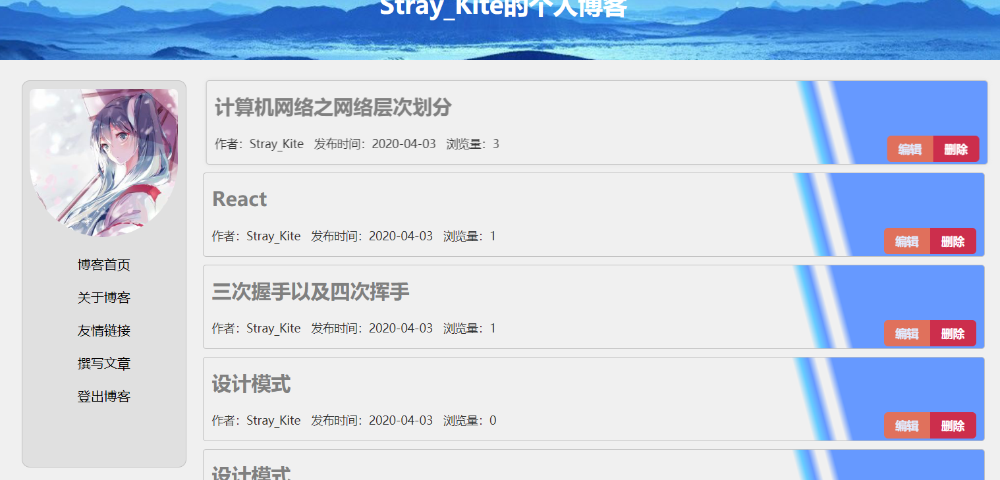
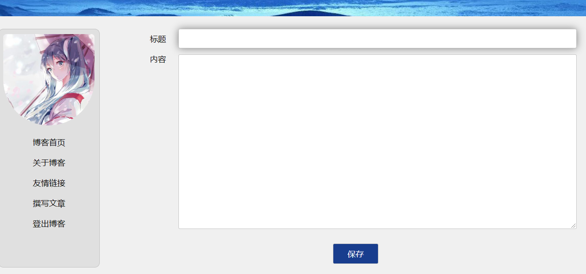
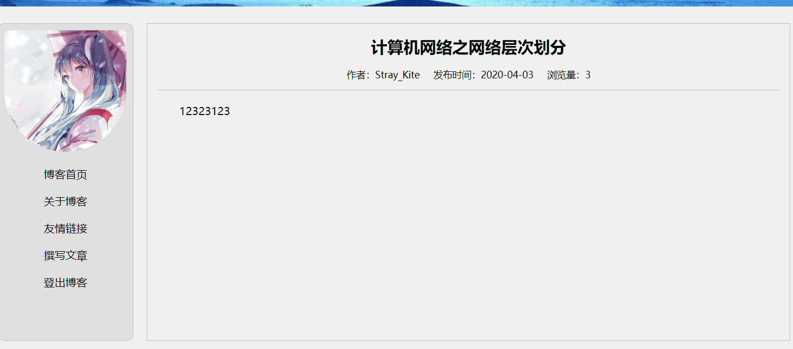

# 个人博客的搭建

## 项目预备知识

> 1. Node.js基础
> 2. MySQL
> 3. Express

## 项目包准备

> 1. mysql：
>
>    ```javascript
>    cnpm i mysql -S
>    ```
>
> 2. crypto（MD5加密用户）：
>
>    ```javascript
>    cnpm i crypto -S
>    ```
>
> 3. express-session:
>
>    ```javascript
>    cnpm i express-session -S
>    ```

## 项目结构

> 左边为项目路径，右边为更细一步的路径
>
> 

## 数据库设计

> 数据库blog，有两个数据表,下面的那个加密后的密码其实就是 **123456**
>
> **表一**  author
>
>  
>
> **表二**  article：
>
>  
>
> ```mysql
> CREATE DATABASE IF NOT EXISTS blog CHARACTER SET utf8;
> 
> USE blog;
> 
> CREATE TABLE author(
> authorID INT KEY AUTO_INCREMENT,
> authorName VARCHAR(20) NOT NULL UNIQUE,
> authorPassword VARCHAR(32) NOT NULL
> );
> 
> CREATE TABLE article(
> articleID INT KEY AUTO_INCREMENT,
> articleTitle VARCHAR(100) NOT NULL,
> articleAuthor VARCHAR(20) NOT NULL,
> articleContent LONGTEXT NOT NULL,
> articleTime   DATE NOT NULL,
> articleClick INT DEFAULT 0
> );
> 
> INSERT author VALUES(DEFAULT, 'Stray_Kite', 'e10adc3949ba59abbe56e057f20f883e');
> ```

## 项目截图

> 登录界面
>
>  

> 首页界面,图一为未登录时的首页，图二未登录时的首页
>
>  
>
>  

> 撰写文章页面
>
>  

> 文章详情页
>
>  
